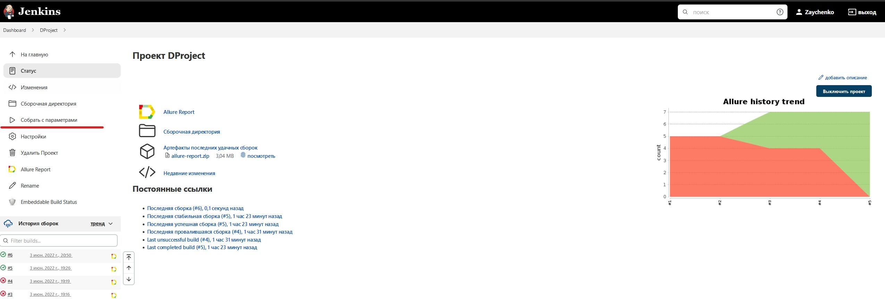
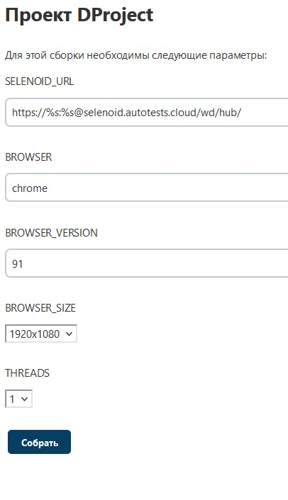
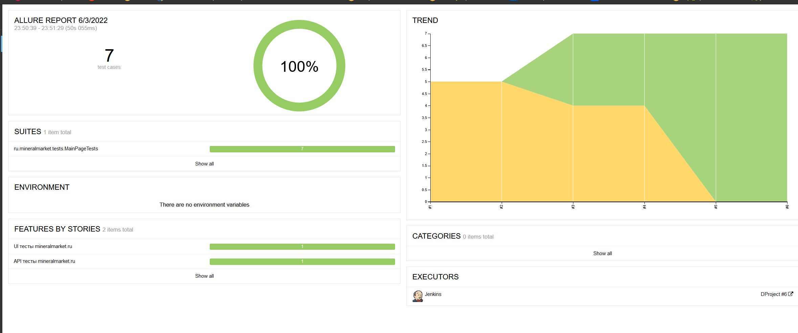
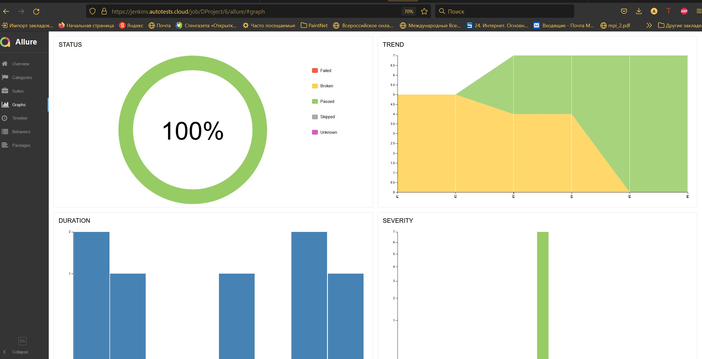
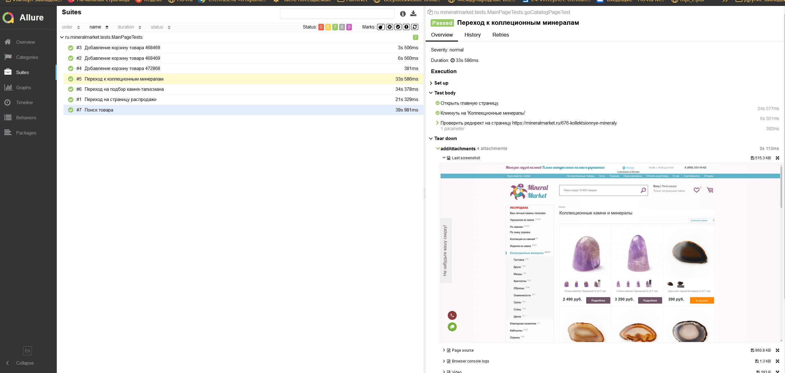
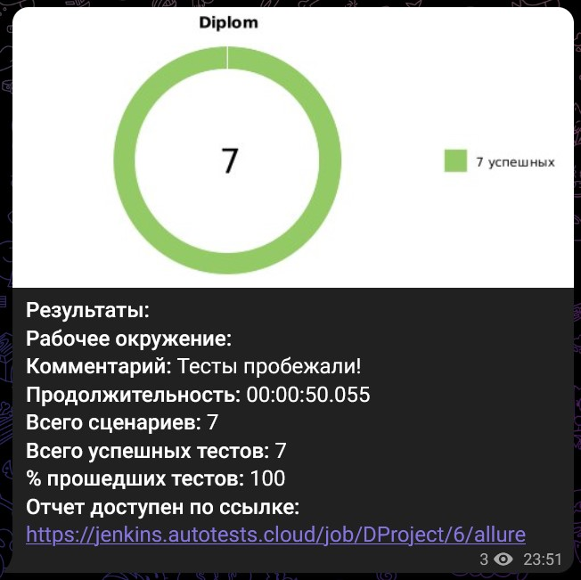
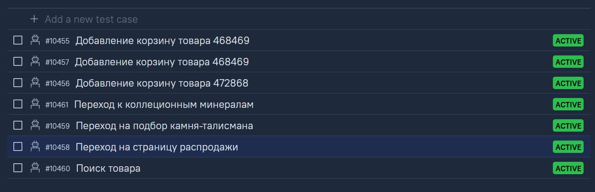
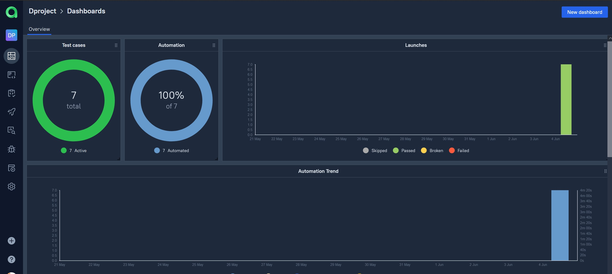
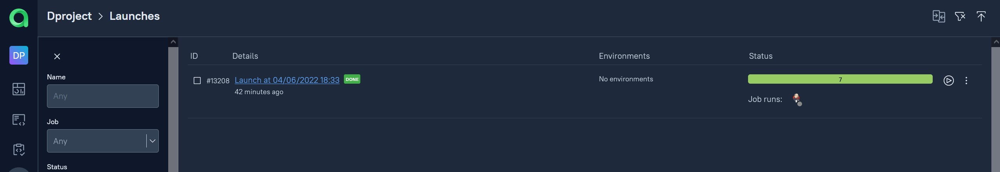

# Проект автоматизации тестирования для <a target="_blank" href="https://mineralmarket.ru/">МинералМаркет</a> 

## :open_book: Содержание:
- [Технологии и инструменты](#gear-в-проекте-используются-следующие-технологии-и-инструменты)
- [Что проверяем](#heavy_check_mark-что-проверяем)
- [Запуск тестов из Jenkins](#-запуск-тестов-из-jenkins)
- [Запуск тестов из терминала](#computer-запуск-тестов-из-терминала)
- [Отчеты](#bar_chart-отчеты-о-прохождении-тестов-доступны-в-allure)
- - [Allure](#-allure)
- - [Telegram](#-telegram)
- [Видео с прогоном тестов](#movie_camera-видео-с-прогоном-тестов)
- [Allure TestOps](#-проект-интегрирован-с-allure-testOps)

## :gear: В проекте используются следующие технологии и инструменты:

<p align="center">


</p>

## :heavy_check_mark: Описание
В проекте автоматизирована проверка главной страницы сайта МинералМаркет, а также переходы на несколько ключевых страниц сайти и проверка добавления товаров в корзину через REST API. Использован паттерн проектирования автотестов PageObject.

## :heavy_check_mark: Что проверяем

> - Переход на страницу "Распродажа";
> - Переход на страницу "Коллекционные минералы";
> - Переход на страницу "Подбор камня-талисмана";
> - Проверка Поиска товара;
> - Добавление товара через API.

##  Запуск тестов из [Jenkins](https://jenkins.autotests.cloud/job/VarlamovaNadezhda_qa_guru_10_diplom_ui/)

Для запуска тестов из Jenkins:
1. Необходимо нажать кнопку "Собрать с параметрами".

2. Выбрать параметры.

3. Нажать кнопку "Собрать".

### :heavy_plus_sign: Параметры сборки

> - BROWSER (браузер)
> - BROWSER_VERSION (версия браузера)
> - BROWSER_SIZE (размер окна браузера)
> - THREADS (количество потоков)

## :computer: Запуск тестов из терминала

Для локального запуска необходимо выполнить команду:
```
gradle clean test
```

## :bar_chart: Отчеты о прохождении тестов доступны в Allure

###  Allure

#### Главная страница



#### Графики



#### Тесты



###  Telegram

Настроена отправка оточета ботом в Telegram



## :movie_camera: Видео с прогоном тестов

В отчетах Allure для каждого теста прикреплен не только скриншот, но и видео прохождения теста

<p align="center">
  
</p>

## Проект интегрирован с Allure TestOps
 

#### Представлены тест-кейсы



#### Представлены дашборды аналитики



#### Представлены запуски



